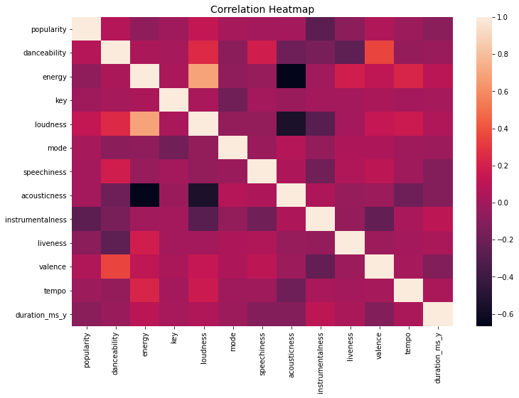
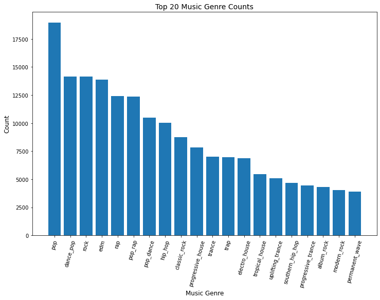
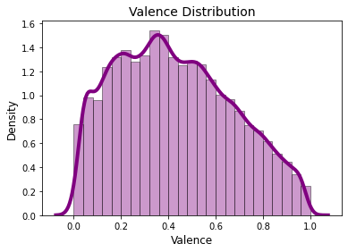
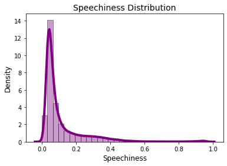
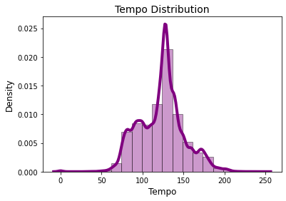
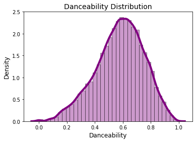
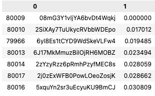
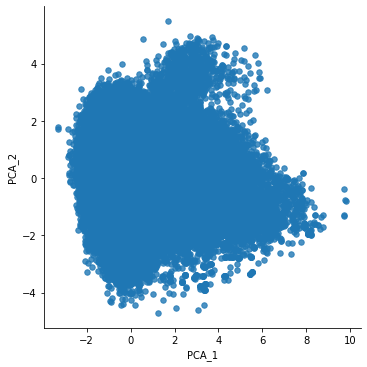
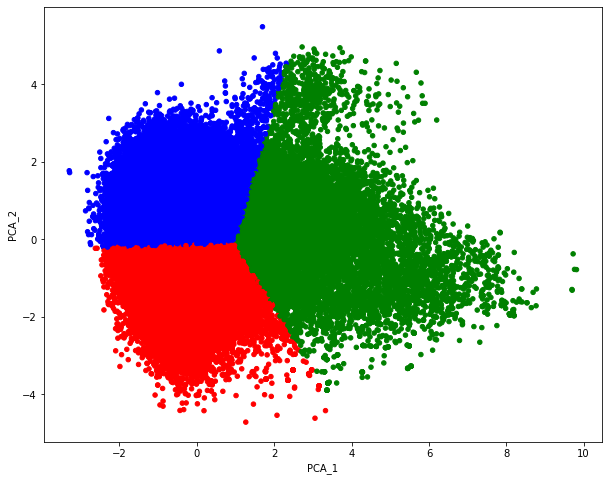
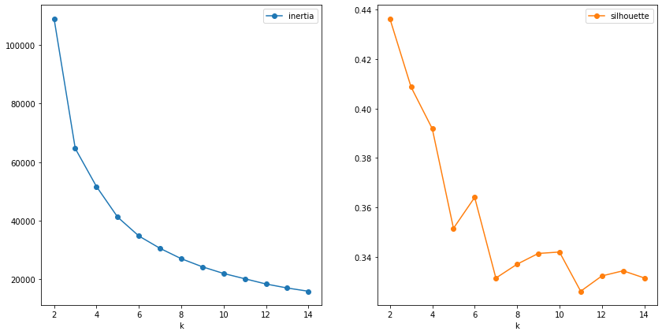

# GA_capstone: Song Recommendation System
## Son Nguyen - General Assembly DSI-111
---
# Part 1 
---
# Problem Statement
With millions of songs on Spotify's platform it can be very overwhelming finding songs. The platform has 82 million songs as well as various podcasts. Individuals do not have access to user data for recommendations. Is it possible to create a recomendation system with out user data? According to sources, having no user data and making a recommendation is called the 'Cold Start' problem. An example of a use case for a cold start recommender would be a DJ who is looking for similar songs.

### Contents 
- [Background](#Background)
- [Data Dictionary](#Data-Dictionary)
- [Exploratory Data Analysis](#Exploratory-Data-Analysis)
- [Modeling & Transformation](#Modeling-&-Transformation)
- [Conclusion](#Conclusion)

### Background
Using the Spotify API, 82,000+ songs were pulled from the database. The process to pull songs required several steps. First, the artist input search was required. Next, using the Artist's URI's, the albums can be obtained. After album URI's are obtained, we have to go back into the API and and pull each album. After obtaining the ablum data, we can extract the song URIs. After obtaining son URI's song features are pulled. Song popularity comes from a seperate pull, so each song will pull from 2 seperate endpoints. 

### Data Dictionary
|Feature|Type| Description|
|---|---|---|
|Tempo|Float|Speed/Pace|
|Danceability|Float|Danceability|
|Energy|Float|Sound Energy|
|Key|Int|note/chord|
|Speechiness|Float|verbal detection|
|Loudness|Float|Loudness Unit Full Scale|
|Acousticness|Float|How acoustic song is|
|Instrumentalness|Float|How instrumental song is|
|Liveness|Float|Detects live crowd|
|Valence|float|Mood of song|
|Popularity|Int|How popular track is|
|Artist Genre|string|Artist Genre|

### EDA

### Modeling & Transformation
The first way to look at recommendinding songs is through the cosine similarities on a matrix. Taking each row and standardizing the data should give a prediction on the most similar songs. The matrix comes out to about 6.7 million calculations. The following figure gives a representation of the matrix. 

|Song|song_1|song_2|song_3|song_4|song_5|
|---|---|---|---|---|---|
|song_1|1.0|0.6|0.8|0.4|0.0|
|song_2|0.6|1.0|0.5|0.9|0.2|
|song_3|0.8|.5|1.0|0.7|0.7|
|song_4|0.4|0.9|0.7|1.0|0.3|
|song_5|0.0|0.2|0.7|0.3|1.0| 

Inputting a song into the matrix will return the similarity scores of the songs. Ordering similarities in the dataframe by decending order will give the closest reccomendations to the inputted song

The table above shows the similarity distance from each ID. The output for the closest songs came from the same artist and the next closest songs were all of the artist's songs. For a recommendation system, this could be useful if you were looking at the same artist or very similar artists. Another method, however, could be clustering the data into groups. 

By vectorizing the artist's genres, there are 1200+ columns in our dataset. The plot above shows the dimentionality reduction to 2 components. After using PCA to reduce the dimensionality, we will cluster the data with K-Means

The second plot shows the reduction in dimensionality and how the data was then clustered. This method makes it easy to visualize our data and how the data is clustered. 

### Conclusion
Modeling a cold start recomendation system is very difficult, but I found that manipulation and transforming the data can be a great first step to creating a great recommendation system. Using PCA, we can reduce high dimensional data for the K-means algorithm. Once we are able to cluster, we can find the closest points in the cluster and make a recommendation.

|Rank|Method|Features|Number of K's|Inertia|Silhouette Score|
|---|---|---|---|---|---|
|T3|K-means|2 primary features|2|70854.65|0.37|
|T3|K-means|10 primary features|2|849443.70|0.23|
|2|PCA, K-means|10 primary features reduced to 2 components|3|61323.30|.40|
|1|PCA, K-means|10 primary + vectorized genres, reduce to 5 components|3|256750.22|.99|